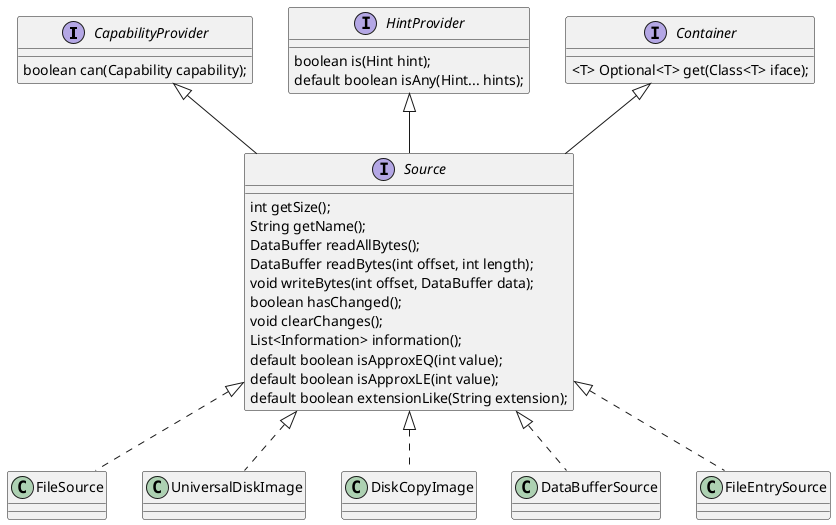
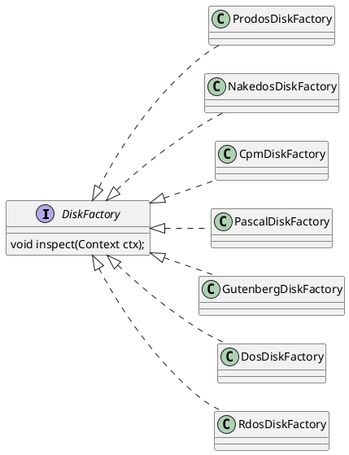

## API changes

As of AppleCommander 12, the API is starting to be redesigned. This page will capture what the "new world" looks like
if you are a developer using the AppleCommander APIs.

Changes (so far):

* `ByteArrayImageLayout` was replaced with `Source`.
* `Source` discovery mechanism is now in `Source.Factory`.
* `Sources#create(Object)` is now used to create `Source` objects. Sometimes with a special `Source`.
* `Disk` was removed. After discovery was removed, it was just a placeholder and all functionality was merged into `FormattedDisk`.
* Constants from `Disk` are now in `DiskConstants`.
* `FormattedDisk` discovery mechanism is now in `DiskFactory`.
* `Disks#inspect(Source)` is now used to initiate the `FormattedDisk` discovery mechanism.
* `ImageOrder` was replaced by `Device`. Specific cases are `BlockDevice` and `TrackSectorDevice`.

### Accessing a disk image

With the removal of `Disk` as the discovery and creation mechanism, there are a couple of replacement hooks to be aware of:
A `FormattedDisk` originates from a `Source` (new) and is created via the discovery mechanism supported by `Disks`.

That is:

1. Create a `Source` via `Sources`.
2. Use `Disks` to "discover" a list of `FormattedDisk` objects.

### Sources

A `Source`, which replaces the layout, does some of the same stuff but supports discovery and complex types (such as 2IMG and DiskCopy).
Note that a source can wrap around another source, allowing a constant GZip support or data source (such as a `FileEntry` on an image
or a Shrinkit archive).

```java
Source source = Sources.create(filename).orElseThrow();
```

To create a source, pass in a `String`, `File`, `Path`, or another `Source` to the `Sources` factory. The `create(...)` method
returns an `Optional<Source>` just in case -- mostly, you can ignore the optional part and just retrieve the object.



This is the interface for a `Source` factory. Note that in the first pass, a `Source` is identified via `fromObject(Object)`
and in the second pass is identified via `fromSource(Source)`. The `FileSource` is identified in the first round (handling GZip as well);
while the `DiskCopyImage` and `UniversalDiskImage` is identified via the second mechanism. Note that the `FileEntry` source
comes in programmatically (as in via a double-click in the GUI) and `DataBufferSource` is used for blank (new) images.

```java
interface Source.Factory {
    Optional<Source> fromObject(Object object);
    Optional<Source> fromSource(Source source);
}
```

### Disks

To identify disks, a `DiskFactory` has been created that allows every type of disk to have its own dedicated discovery mechanism.
Prior to this, all that logic was mashed into the (old) `Disk` class and partially handled in the constructor and then handled
in the `getFormattedDisks` method itself. The intent of a `DiskFactory` is to get that logic out of the `Disk` and into a
dedicated filesystem (or other) discovery mechanism.



Harnessing the `DiskFactory` is rather straight-forward. Use `Disks#inspect(Source)` to initiate discovery. For example:

```java
Source source = Sources.create(imageName).orElseThrow();
DiskFactory.Context ctx = Disks.inspect(source);
```

This will hand back a `Context`. This contains all the information used to create `FormattedDisk`s, including the `Source`,
and any `NibbleTrackReaderWriter`s should that be applicable.

```java
public class Context {
    public final Source source;
    public final NibbleTrackReaderWriter nibbleTrackReaderWriter;
    public final List<FormattedDisk> disks = new ArrayList<>();
    public BlockDeviceBuilder blockDevice();
    public TrackSectorDeviceBuilder trackSectorDevice();
}
public class BlockDeviceBuilder {
    public BlockDeviceBuilder include16Sector(Hint hint);
    public BlockDeviceBuilder include800K();
    public BlockDeviceBuilder includeHDV();
    public List<BlockDevice> get();
}
public class TrackSectorDeviceBuilder {
    public TrackSectorDeviceBuilder include13Sector();
    public TrackSectorDeviceBuilder include16Sector(Hint hint);
    public List<TrackSectorDevice> get();
}

```

Most of the time, `disks` is what you'll need. If nothing is recognized, `disks` will be empty, however, the device
builder may be used to create an appropriate device. If applicable, a `NibbleTrackReaderWriter` will be avilable (either `*.nib`
or a `*.woz` image).  Of course, `Source` is what is handed into the `Disks#inspect(Source)` method.

Examples of using the builder interfaces:

=== "TrackSectorDevice"

    ```
    List<TrackSectorDevice> sectorDevices = ctx.trackSectorDevice()
                    .include13Sector()
                    .include16Sector(Hint.DOS_SECTOR_ORDER)
                    .get()
    ```

=== "BlockDevice"

    ```
    List<BlockDevice> blockDevices = ctx.blockDevice()
            .include16Sector(Hint.PRODOS_BLOCK_ORDER)
            .include800K()
            .includeHDV()
            .get();
    ```

### Other (semi-experimental)

> Some of these are in play today (`DataBuffer`, `HintProvider`, and `Information`) and others are partly implemented 
(`CapabilityProvider` and `Container`).

#### DataBuffer

A lot of functionality was encompassed in `AppleUtil`. As an experiment, `DataBuffer` has been created to wrap around that 
functionality (reading unsigned bytes, unsigned words, 32-bit integers, handling little-ending vs big-endian numbers, etc).
That `DataBuffer` can "get" from a specified offset, or can "read" in a forward manner. Usage depends on what is needed.

#### CapabilityProvider

The concept of a capability is "what can this -thing- do?"  This is still early and won't really show up until devices
are put together. But you might as if this "thing" can "write" or "save to disk". Instead of having a bunch of dedicated
"is" methods, this should help clean up the API.

```java
public interface CapabilityProvider {
    boolean can(Capability capability);
}
```

Expected usage:

```java
FormattedDisk disk = ...;
if (disk.can(Capability.SAVE_TO_FILE)) {
    window.enableSaveButton();
}
```

#### HintProvider

"Hints" are used to indicate somewthing we know. In particular, a `Hint` is used while creating the disk image. One example
is if we know the sector ordering for a disk. We can provide that hint for certain sources (DiskCopy, 2IMG, and the current
`FileEntry` sources do this).

```java
public interface HintProvider {
    boolean is(Hint hint);
    default boolean isAny(Hint... hints);
}
```

Example usage:

```java
if (source.is(Hint.PRODOS_BLOCK_ORDER)) {
    // ...
}
```

#### Container

A "Container" allows pulling out internal components without providing a bunch of random "get" methods. For instance, the current
`FormattedDisk` (and `Disk` before that) as well as (the retired) `ImageOrder` all support both block and track/sector reading and writing. 
So, a ProDOS disk has reading by block or sector. DOS hsa reading by block or sector, etc. RDOS has, not only block or sector, 
but also "RDOS" block (256) bytes; and CP/M is the same except the CP/M block is 1024 bytes. It would be nice to hide all that 
cruft and "ask" the (in this case) file system if it supported a particular type of device. That's where containers come into 
play -- we expose one "get" method that then looks for that type of item. It returns a Java `Optional`, so it may not and we 
can handle that accordingly.

```java
public interface Container {
    <T> Optional<T> get(Class<T> iface);
}
```

Expected usage:

```java
Optional<BlockDevice> blockOpt = disk.get(BlockDevice.class);
blockOpt.isPresent(device -> {
    DataBuffer data = device.readBlock(0);
    // ...
});
```

#### Information

A lot of things have extra information about them. DiskCopy has image type, disk name, and disk format (for instance) while
2IMG supports ordering, creator, and comments. These are available through a generic `getInformation()` method call.

```java
public record Information(String label, String value) {
}
```

Note that the `Information` record includes a builder to aid in construction.

```java
@Override
public List<Information> information() {
    List<Information> list = source.information();
    // ...
    list.add(Information.builder("Image Type").value("Universal Disk Image (2IMG/2MG)"));
    list.add(Information.builder("ProDOS Blocks").value(info.prodosBlocks()));
    list.add(Information.builder("Data Offset & Length").value("$%08x & %08x",
            info.dataOffset(), info.dataLength()));
    // ...
}
```
