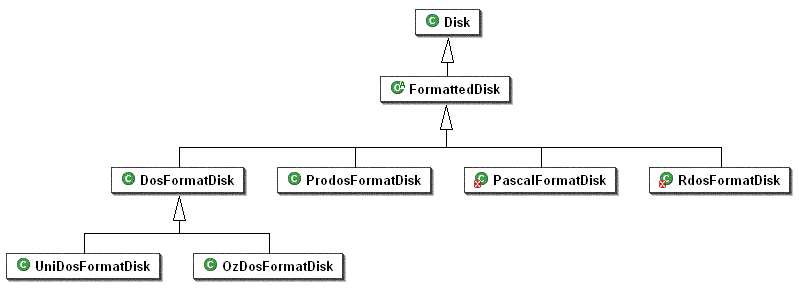
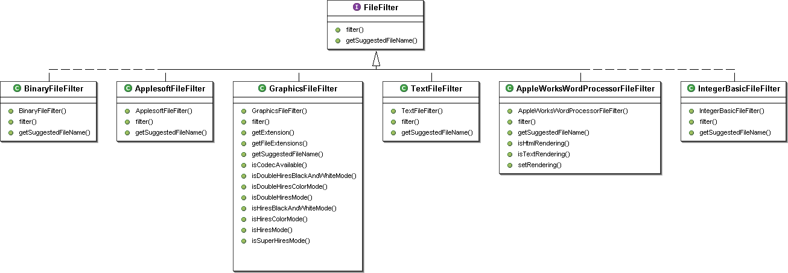
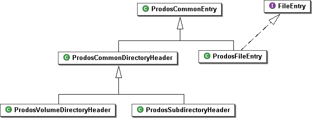

!!! warning "Deprecated"
    This design is being deprecated as of AppleCommander 12. See the [new API](redesign.md)
    documentation for details.

## Disk and FormattedDisk

Generally, a `Disk` represents an Apple ][ disk image.  This can be size, any order, and any
format.  The `Disk` class itself manages the varying disk order (DOS, ProDOS, or their variants)
simply by the file extension.  `Disk`s that are formatted with an operating system are managed
by the subclasses of `FormattedDisk`.  The general user interface(s) can then work with a
`FormattedDisk` without knowing about the specific operating system.

Somewhat surprisingly, a `Disk` can contain multiple `FormattedDisk`s.  By structuring the disk image
in this manner, the 800K DOS formats can be accommodated (yielding two 400K DOS `FormattedDisk`s -
which models the physical behavior rather nicely).  Additionally, other configurations
can be accommodated in the future - Pascals multiple volume configuration or a ProDOS volume
hosting DOS 3.3 and/or Pascal volumes.

## FileEntry

Each `Disk` contains multiple files.  The file is represented by a `FileEntry`.  You will note that
the attributes exposed by the `FileEntry` interface are pretty generic.  To accommodate the various
views available, the `getFileColumnData` method was added.  This method will, depending on the
setting, return a standard view, a native view (mimics the native catalog/directory display), and
a detailed view (giving all available data on the files).

## FileFilter

In order to allow AppleCommander to export files easily, the concept of a `FileFilter` was added.
A `FileFilter` simply takes the raw data from the `FileEntry` and then processes it according to the
filter.  Adding new filters is as easy as implementing the `FileFilter` interface and then hooking
it into the user interface!

## ProdosCommonEntry

Just to be complete, ProDOS yielded itself to a simple object hierarchy.

