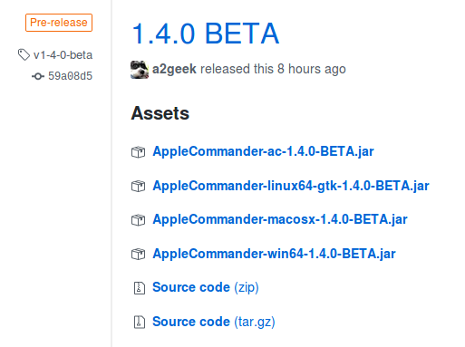
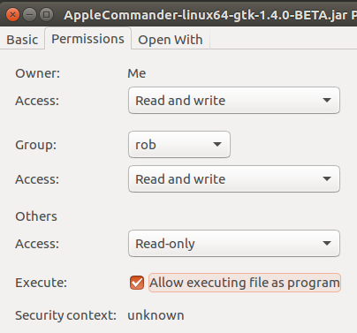

This section covers installation of AppleCommander. As of 1.4.0, this should be a bit simpler as SWT is now packaged for each platform.

### Install Java

If you do not already have Java 11 (or later) installed, you will be required to install one.

There are a number of methods to install a Java JVM:

* From the [AdoptOpenJDK site](https://adoptopenjdk.net/).
* On Mac OS X: Using [Homebrew](https://brew.sh/) and installing via `brew install openjdk@11`
* On Ubuntu Linux: `sudo apt install openjdk-11-jdk`

These aren't the only options, so do what make sense for you. 

> If there are other options, feel free to add a ticket or submit a pull request.

### Mac note

With the new Macs that have been released, there is a new wrinkle to pay attention to. These new Macs can run the old (Intel) code as well as the new Apple Silicon (ARM/aarch64), which can lead to some confusion. Either will work. But, the JVM and AppleCommander need to match. If you install a `x86_64` JVM, be sure to run that version of AppleCommander.

### Download AppleCommander

Visit the [AppleCommander release page](https://github.com/AppleCommander/AppleCommander/releases) and download the JAR file for your system.  It will look something like this:



#### Graphical Interface

The GUI component comes pre-packaged with all needed dependencies. You do not need to find and install the SWT toolkit any more!

* For Windows use the file with `AppleCommander-win32-x86_64-VERSION.jar`.
* For Macintosh use one of the following:
    * Intel Macs: `AppleCommander-macosx-x86_64-VERSION.jar`.
    * M1+ Macs: `AppleCommander-macosx-aarch64-VERSION.jar`.
* For Linux use:
    * Intel: `AppleCommander-linux-x86_64-VERSION.jar`.
    * ARM 64-bit: `AppleCommander-linux-aarch64-VERSION.jar`.
* For 32-bit Raspberry Pi's use: `AppleCommander-linux-arm-VERSION.jar`.

Generally, once the JAR is downloaded, just double-click on the file!

For Mac OS X, AppleCommander's windowing library (SWT) requires the `-XstartOnFirstThread` flag. Starting AppleCommander will need to be from a script something like:
```bash
#!/bin/sh
java -XstartOnFirstThread -jar ~/bin/AppleCommander-macosx-ARCH-VERSION.jar
```
(ARCH is one of `x86_64` or `aarch64` and VERSION is the current release of AppleCommander.)

For Linux, you may need to set the file to be executable by allowing the JAR file to be executed as a program.



#### Command-line

The distribution file `AppleCommander-ac-VERSION.jar` provides a command-line interface to AppleCommander. It is ready to use immediately, but it may be convenient to rename it (e.g. `ac.jar`) or invoke it from a script, e.g.

GNU bash script for Linux or Mac OS X (`ac.sh`):
```bash
#!/bin/sh
java -jar ~/bin/ac.jar "${@}"
```

MS DOS batch file (`ac.bat`):
```batch
@echo off
java -jar AppleCommander-ac-1.8.0.jar %*
```

There is also a Mac OS X [Apple II homebrew repository](https://github.com/lifepillar/homebrew-appleii) which allows an install of:
```
$ brew install applecommander
```
After it installs, `applecommander` will be a command. Visit the GitHub page for information on how to install the tap.

Alternately, Mac users can choose to [install AppleCommander with MacPorts](https://ports.macports.org/port/AppleCommander).

> Please note: The Mac already has an `ac` command. Setting the alias will "hide" that command. Name it whatever makes sense for your environment - there are no dependencies on the name built into the application.

Unix-like environments have the ability to `alias` a command as well. To create an `ac` command alias, use something like this:
```bash
alias ac='java -jar app/cli-ac/build/libs/AppleCommander-ac-1.8.0.jar'
```
(Adjust the path as it applies to your configuration - this sample pulls from the build directories.)

## Requirements

| AppleCommander Version | Requirements |
| --- | --- |
| 1.7 or later | Java 11 | 
| Up to 1.6 | Java 8 |
