To install the AppleCommander application itself (the "GUI"), there are the methods that can be used:

!!! note "File associations"
    The installers do _not_ make any file associations. At this time, the presumption is that emulators (or other tools) use those file associations.

1. Installation via a distribution package (Windows MSI installer, Macintosh DMG installer, Ubuntu DEB installer, and Fedora RPM installer).
    * From the [desktop](#desktop) (Windows, Macintosh, Ubuntu, Fedora).
    * From the [command-line](#command-line) (Ubuntu, Fedora).
3. Installation the more "traditional way" by installing Java, downloading the proper Java JAR file, and then setting up a launch mechanism. See the [original](original.md) installation notes.
4. Specialized:
    * [Apple II homebrew repository](https://github.com/lifepillar/homebrew-appleii) which also includes many other Apple II tools.
    * [MacPorts](https://ports.macports.org/port/AppleCommander) - but this is very outdated.


<a id="desktop"></a>
## Installation via desktop

=== "Windows"

    To install AppleCommander:

    1. Download the `*.msi` file (hint: has `windows` in the name even though this screenshot doesn't!).
        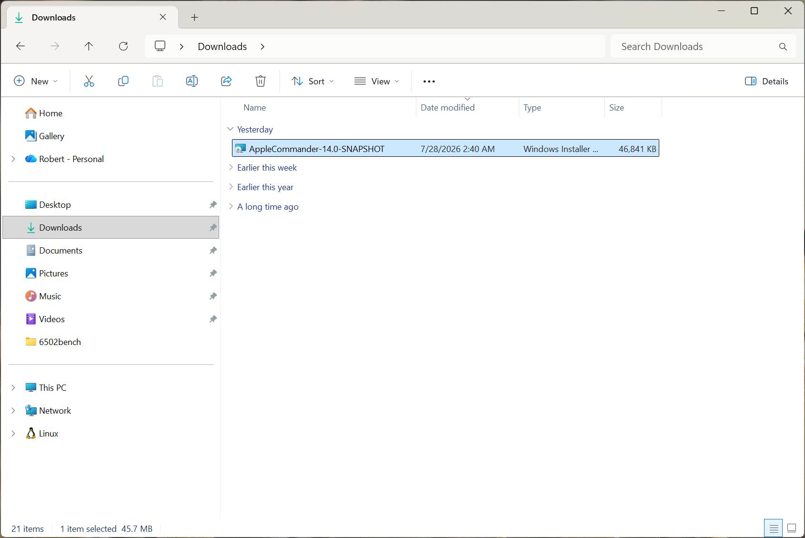
    2. Double-click on the installer. This will launch a typicall Windows installation.
        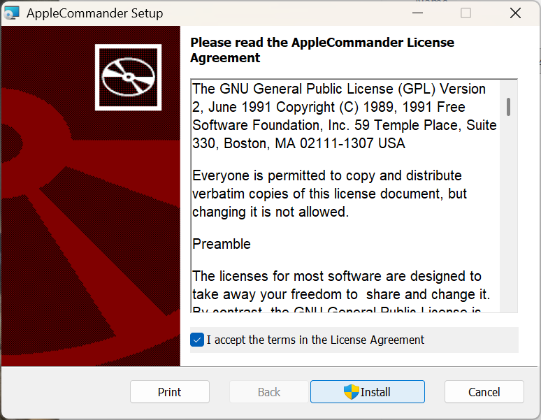
    3. Launch AppleCommander from the menu.

    To uninstall AppleCommander:

    1. Go into the Installed Apps (in Settings). Select the `...` (three dots on the right) and select Uninstall.
        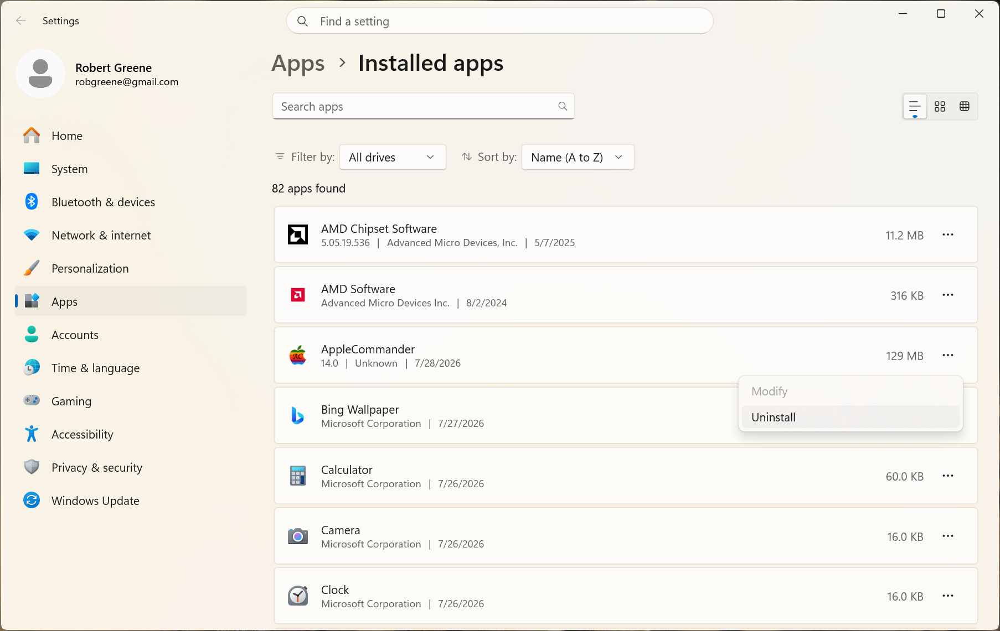

=== "Macintosh"

    To install AppleCommander:

    1. Download the correct `*.dmg` file. The name will be `AppleCommander-VERSION-mac-ARCH.dmg` where "ARCH" is either `x86_64` (older Intel based Macs) or `arm64` (newer Apple-silocon based macs, presumably both M1+ and the "A" chip).
    2. Double-click on the downloaded file.
        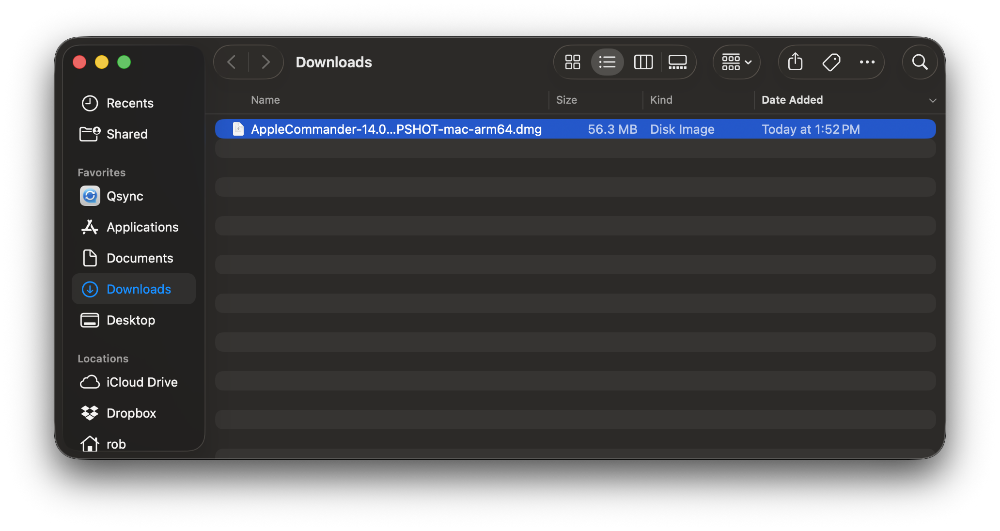
    3. Accept the license agreement.
        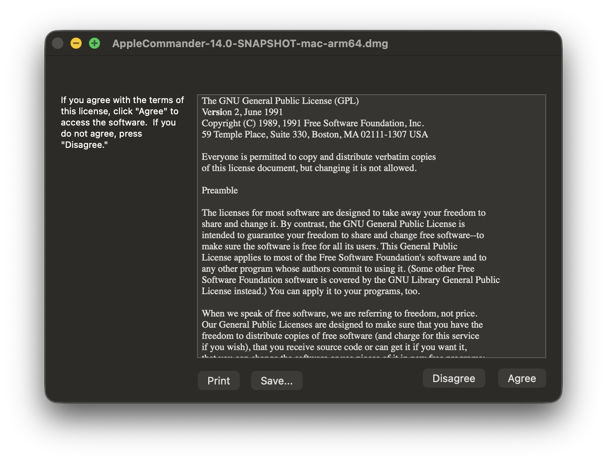
    4. Drag the AppleCommander icon onto the Applications folder.
        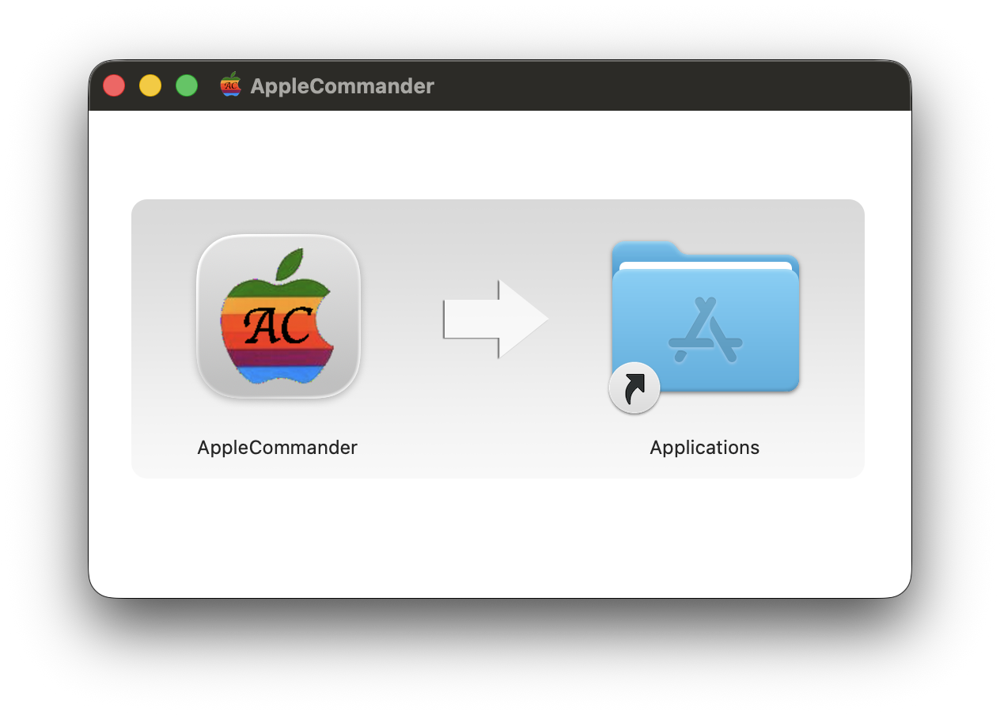
    5. Tell MacOS that the application is OK to run. From a terminal type:
        ```
        $ xattr -d com.apple.quarantine /Applications/AppleCommander.app
        ```
       (Alternatively, you can _try_ to launch AppleCommander. The first time, go into the Security sections and allow AppleCommander to run.)
    5. The application has been installed!
    6. Some final cleanup. On the desktop, you have to eject the install media.
        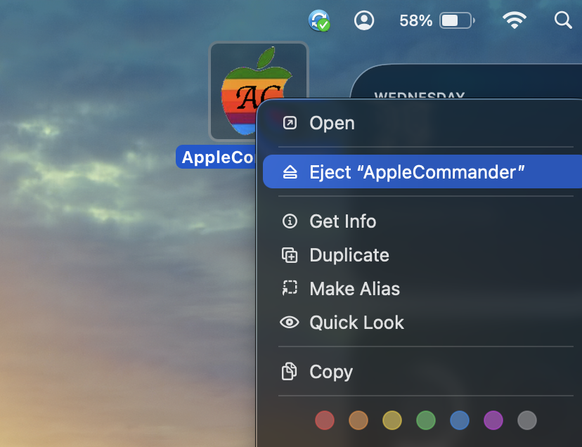

    To uninstall AppleCommander:

    1. Open up the Applications folder
    2. Right-click on the AppleCommander icon and select "Move to Trash".
        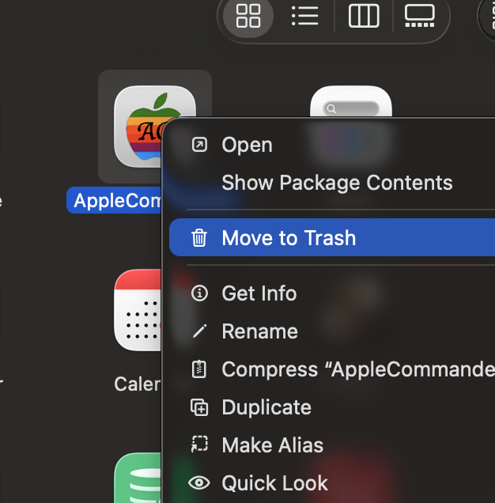

=== "Linux (Ubuntu/DEB)"

    !!! warning "Unsigned installers"
        Please note that these installers are _unsigned_. That means that there are usually some extra steps to say "yes, I really want to install/run this app." Other than that, they should work fine.

    !!! info "Uninstallation"
        To uninstall AppleCommander, you will have to use the command-line as App Center does not list the application.

    1. Download the correct `*.deb` for your platform. The name will be `AppleCommander-VERSION-linux-ARCH.deb` where "ARCH" is either `x86_64` (Intel/AMD chip) or `arm64` (for ARM-based computers).
    2. Double-click on the downloaded file. This should open App Center. If it doesn't open by default (a quick search indicates this does happen), right-click on the file and select "Open with App Center".
       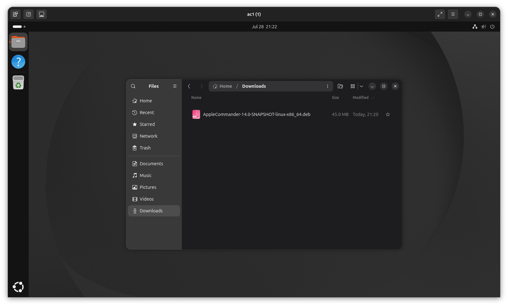
    3. Click the "Install" button. Note that App Center does not like the unsigned media.
       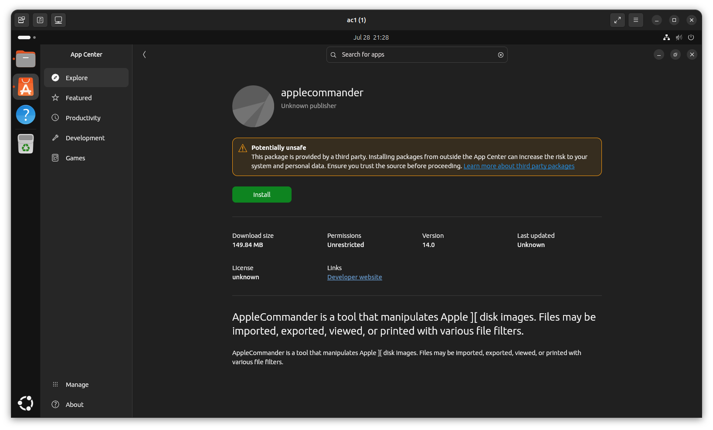
    4. Tell App Center "yes, I really want to install."
       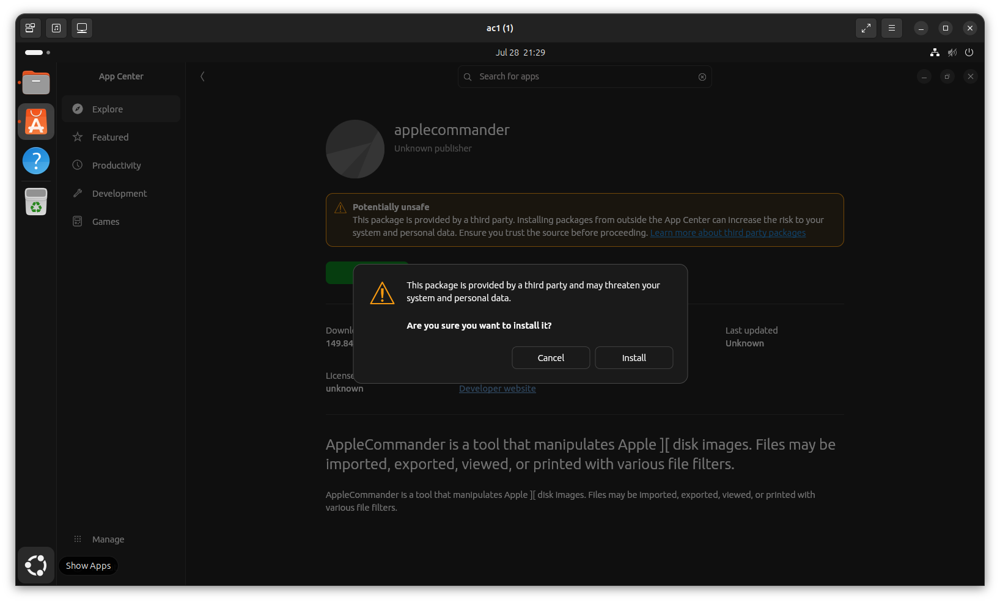
    5. AppleCommander should now be in your menu!
       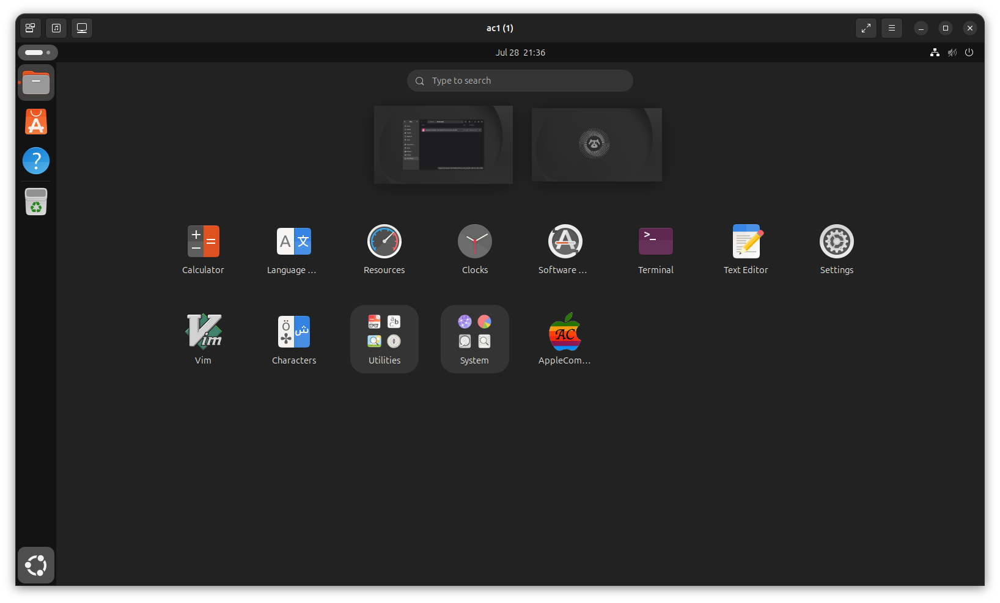
    6. Click the icon to launch.

=== "Linux (Fedora/RPM)"

    To install AppleCommander:

    1. Download the correct `*.rpm` for your platform. The name will be `AppleCommander-VERSION-linux-ARCH.rpm` where "ARCH" is either `x86_64` (Intel/AMD chip) or `arm64` (for ARM-based computers).
    2. Double-click on the downloaded file. This should open the Software applocation.
        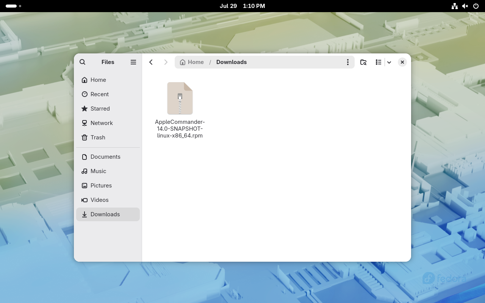
    3. Click the "Install" button.
        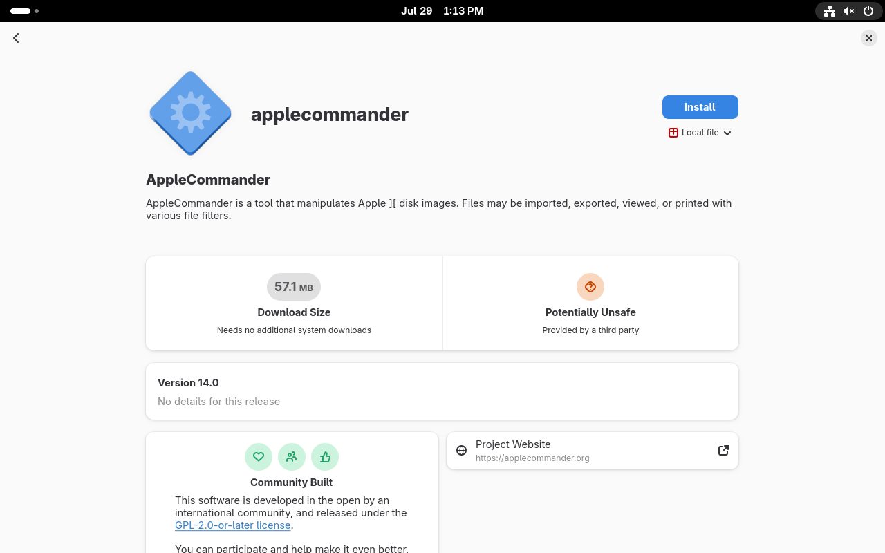
    4. AppleCommander should now be in your menu!
        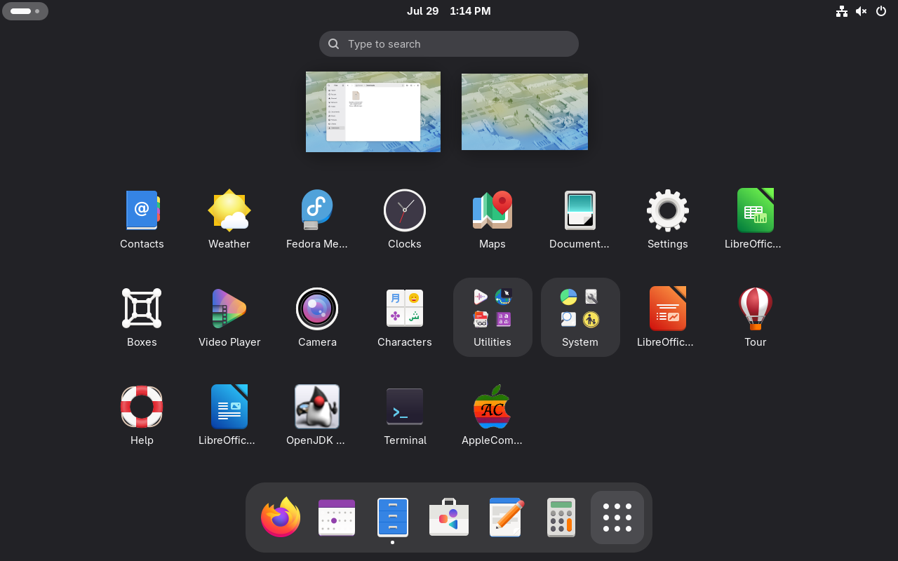

    To uninstall AppleCommander:

    !!! info
        You can also opt to remove from the command-line. However, from what I observed, Software still thinks it's installed. No harm, just odd. ¯\(ツ)/¯

    1. The Software application *will not list it as installed*.
    2. Navigate to a downloaded version of the AppleCommander RPM file (uncertain if the version needs to match). Double-click on the downloaded file.
        
    3. Click the "uninstall" button.
        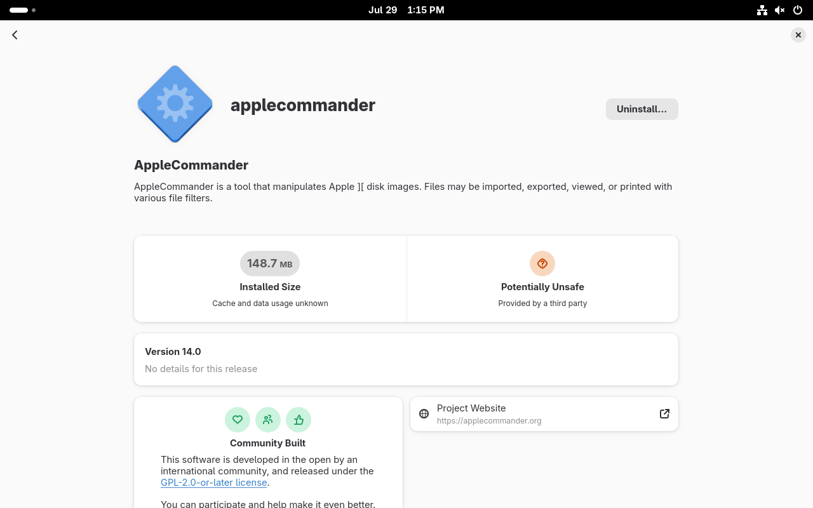
    4. AppleCommander has been removed.

<a id="command-line"></a>
## Installation via command-line

These are a bit more brief, as the assumption is more familiarity with the command-line.

=== "Linux (Ubuntu/DEV)"

    To install AppleCommander:

    1. Open a terminal.
    2. Run `sudo apt install`. If the error (last line below) is troublesome, move the `*.deb` file into `/tmp` and install from there. There doesn't appear to be any issues with the install.
        ```
        $ sudo apt install ~/Downloads/AppleCommander-14.0-SNAPSHOT-linux-x86_64.deb 
        Note, selecting 'applecommander' instead of '/home/rob/Downloads/AppleCommander-14.0-SNAPSHOT-linux-x86_64.deb'
        Installing:                 
        applecommander

        Summary:
        Upgrading: 0, Installing: 1, Removing: 0, Not Upgrading: 2
        Download size: 0 B / 45.0 MB
        Space needed: 150 MB / 216 GB available
        <snip>
        Notice: Download is performed unsandboxed as root as file '/home/rob/Downloads/AppleCommander-14.0-SNAPSHOT-linux-x86_64.deb' couldn't be accessed by user '_apt'. - pkgAcquire::Run (13: Permission denied)
        ```
    3. AppleCommander is now in the menu and can be used normally!

    To uninstall AppleCommander:

    1. Open a terminal.
    2. Run `sudo apt remove applecommander`. Note that the name is `applecommander` not `AppleCommander`.
        ```
        $ sudo apt remove applecommander
        REMOVING:                       
        applecommander

        Summary:
        Upgrading: 0, Installing: 0, Removing: 1, Not Upgrading: 2
        Freed space: 150 MB

        Continue? [Y/n] 
        (Reading database… 256927 files and directories currently installed.)
        Removing applecommander (14.0)…
        ```
    3. AppleCommander has been uninstalled.

=== "Linux (Fedora/RPM)"

    To install AppleCommander:

    1. Open a terminal.
    2. Run `sudo dnf install`.
        ```
        $ sudo dnf install Downloads/AppleCommander-14.0-SNAPSHOT-linux-x86_64.rpm
        Updating and loading repositories:
        Repositories loaded.
        Package                                        Arch        Version                                        Repository                    Size
        Installing:
        applecommander                                x86_64      0:14.0-1                                       @commandline             141.8 MiB

        Transaction Summary:
        Installing:         1 package

        Total size of inbound packages is 54 MiB. Need to download 0 B.
        After this operation, 142 MiB extra will be used (install 142 MiB, remove 0 B).
        Is this ok [y/N]: y
        Running transaction
        [1/3] Verify package files                                                                          100% |   1.0   B/s |   1.0   B |  00m01s
        [2/3] Prepare transaction                                                                           100% |   5.0   B/s |   1.0   B |  00m00s
        [3/3] Installing applecommander-0:14.0-1.x86_64                                                     100% |  49.7 MiB/s | 141.9 MiB |  00m03s
        Warning: skipped OpenPGP checks for 1 package from repository: @commandline
        Complete!
        ```
    3. AppleCommander is now in the menu and can be used normally!

    To uninstall AppleCommander:

    1. Open a terminal.
    2. Run `sudo dnf remove applecommander`. Note that the name is `applecommander` and not `AppleCommander`.
        ```
        $ sudo dnf remove applecommander
        Package                                        Arch        Version                                        Repository                    Size
        Removing:
        applecommander                                x86_64      0:14.0-1                                       @commandline             187.4 MiB

        Transaction Summary:
        Removing:           1 package

        After this operation, 187 MiB will be freed (install 0 B, remove 187 MiB).
        Is this ok [y/N]: y
        Running transaction
        [1/2] Prepare transaction                                                                           100% |   3.0   B/s |   1.0   B |  00m00s
        [2/2] Removing applecommander-0:14.0-1.x86_64                                                       100% | 345.0   B/s | 312.0   B |  00m01s
        Complete!
        ```
