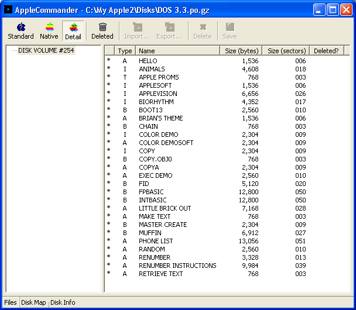
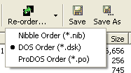

## Windows XP

This is the initial window from which all disk images are opened:

This should be an almost familiar sight, except that the DOS 3.3 master is in a "standard view" - which is pretty much operating-system agnostic:

Ah, much better! This is as close to the DOS 3.3 CATALOG as you'll get:

For those who need all the detail, the detail view will show all information that is available. This view varies significantly by operating system (ProDOS has the most information to show).

A disk usage map is also available.

Along with general information about the disk image.  Don't get confused or concerned regarding the archive order and the disk format - the disk format is how the data is actually written on the disk itself while the order is just the ordering of data in the image that emulators use.

For those operating systems that can, a deleted file listing is also available:

File exports are now an option:

The file export wizard allows you to choose from the supported file types:

The graphics export requires a little more information:

It may not be beautiful, but it allows you to place your files wherever you want them:

The converted Hires color image:

AppleCommander now sports a file viewer:

Disk images of 140K (floppy) may be reordered:

## Ubuntu Linux

This is the initial window from which all disk images are opened:

The current ProDOS 2.4.2 system master:

